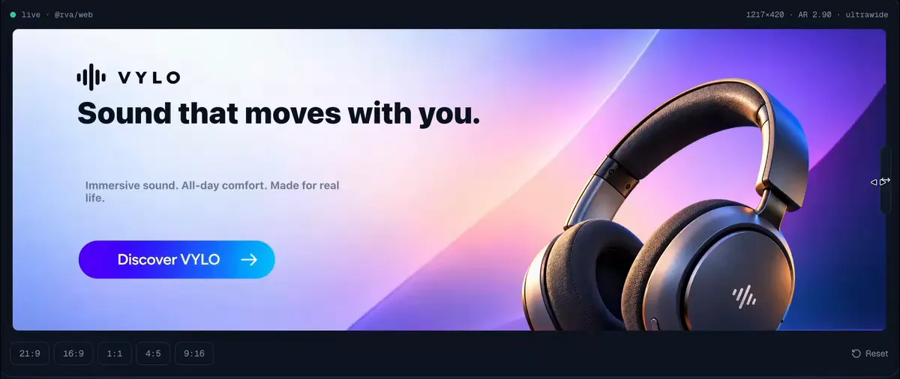

# RVA — Responsive Visual Asset

[](https://rva.airovo.tech/)
[](https://github.com/airovo/rva/actions/workflows/ci.yml)
[](https://github.com/airovo/rva/actions/workflows/conformance.yml)
[](https://github.com/airovo/rva/actions/workflows/deny.yml)
[](LICENSE)

**Internally structured. Externally singular.** RVA is a self-contained visual
asset format and composition model. A single `.rva` file holds independently
renderable resources (raster, vector, text, masks) plus the semantic structure
and responsive constraints needed to *recompose itself* for arbitrary rendering
dimensions — so one asset serves everything from ultrawide to portrait without a
pile of hand-maintained derivatives.

> Status: **experimental / R&D**, not frozen. The signature, media type and some
> schema details may change before a public `0.1`. See [`spec/`](spec).

This repository is the platform-neutral half of RVA: the reference **core**,
**CLI**, **WASM** and **C ABI** bindings, a **server**, and thin **platform
adapters**, together with the conformance suite and test corpora.

> 📚 **Documentation index:** [`docs/`](docs/README.md) — spec, core, adapters,
> conformance and examples in one place.

---

### See RVA in action

One visual asset. Multiple aspect ratios.
Watch the layout adapt without creating separate images.

[](https://rva.airovo.tech/)

**[▶ Try Interactive Demo](https://rva.airovo.tech/)**

Resize, explore, and experience responsive visual assets.

---

## Packages

The core is a resolver; the adapters only render its output. Everything is MIT
licensed and published to the usual registries:

| Package | Registry | Install |
| --- | --- | --- |
| `rva-core` | [crates.io](https://crates.io/crates/rva-core) | `cargo add rva-core` |
| `rva-cli` (`rva` binary) | [crates.io](https://crates.io/crates/rva-cli) | `cargo install rva-cli` |
| `rva-server` | [crates.io](https://crates.io/crates/rva-server) | `cargo install rva-server` |
| `@airovo/rva-web` | [npm](https://www.npmjs.com/package/@airovo/rva-web) | `npm i @airovo/rva-web` |
| `@airovo/rva-node` | [npm](https://www.npmjs.com/package/@airovo/rva-node) | `npm i @airovo/rva-node` |
| `@airovo/rva-react` | [npm](https://www.npmjs.com/package/@airovo/rva-react) | `npm i @airovo/rva-react` |
| `@airovo/rva-vue` | [npm](https://www.npmjs.com/package/@airovo/rva-vue) | `npm i @airovo/rva-vue` |
| `@airovo/rva-svelte` | [npm](https://www.npmjs.com/package/@airovo/rva-svelte) | `npm i @airovo/rva-svelte` |
| `@airovo/rva-react-native` | [npm](https://www.npmjs.com/package/@airovo/rva-react-native) | `npm i @airovo/rva-react-native` |
| `@airovo/rva-types` | [npm](https://www.npmjs.com/package/@airovo/rva-types) | `npm i -D @airovo/rva-types` |
| Swift — `RVA` | [Swift Package Manager](https://github.com/airovo/rva-swift) | `.package(url: "https://github.com/airovo/rva-swift", from: "0.1.0")` |
| `rva_flutter` | [pub.dev](https://pub.dev/packages/rva_flutter) | `flutter pub add rva_flutter` |
| `tech.airovo:rva-android` | [Maven Central](https://central.sonatype.com/artifact/tech.airovo/rva-android) | `implementation("tech.airovo:rva-android:0.1.1")` |

The five normative primitives every binding implements are defined in
[`adapters/contract.json`](adapters/contract.json).

---

## The model

```
.rva  →  parse  →  validate  →  resolve(width, height, environment)  →  ResolvedScene
```

- **Normative core** — parsing, validation, topology selection, constraint
  solving and layout resolution. Deterministic by construction.
- **`ResolvedScene`** — the interop boundary. The core decides **what** to draw;
  each platform renderer decides **how** to draw it with its own graphics stack.

**Determinism invariant**

```
same .rva + same viewport + same spec version + same resolver profile
  = same ResolvedScene
```

The reference resolver profile is `rva-resolve/0.4` (`rva_core::RESOLVER_PROFILE`).
Resolution semantics are stable across runtimes; rasterized pixels may differ.
Text layout uses a fixed, platform-independent advance model
(`core/src/fonts.rs`); real system fonts are used only when *drawing*.

### Scene model (`core/src/model.rs`)

| Concept | Purpose |
|---|---|
| `designSpace` | Intrinsic authoring canvas (master dimensions). |
| `resources` | `id → path` map; resource ids are filename-independent. |
| `text` | Semantic, reflowable text resources with size bounds and styling. |
| `elements` | Raster / vector / text / group / mask with role, priority, crop policy, mask, focal regions, visibility and opacity. |
| `topologies` | Alternative compositions selected by aspect-ratio range; each has a background and per-element layout. |
| `constraints` | Authored relationships between elements (`gap`, `align`, `contain`, `no-overlap`), hard or soft. |
| `fallback` | Canonical flattened representation + fit policy. |

Backgrounds are either a resource id (photo) or a procedural **paint** (solid
colour or linear gradient). Element opacity and text colour/background/line
height/letter & word spacing/alignment are part of the model, and text spacing
participates in the deterministic advance model so wrapping is identical
everywhere.

### Primitive API (normative)

The five operations every binding implements with identical semantics:

| Primitive | Input | Output |
|---|---|---|
| `open` | bytes | handle |
| `describe` | handle | string |
| `resolve` | handle, width, height | ResolvedScene (JSON) |
| `resource` | handle, reference | bytes |
| `has_resource` | handle, reference | boolean |

`relative_for` and `render_png` are non-normative convenience helpers. The
smaller the normative surface, the better.

### Asset sources (convenience, non-normative)

`open(bytes)` is the only normative input. How an asset is *addressed* is a host
concern, and the bindings accept more than raw bytes:

| Adapter | Accepted sources |
|---|---|
| `@airovo/rva-node` | `open(bytes)`; `openSource(path \| file:// \| http(s):// \| data:)` |
| `<rva-image>` (web / vue / svelte / react) | `src` via `fetch` (`http(s)`, `data:`, `blob:`, relative). For `file://` and custom protocols set the element's `bytes` or `srcResolver` |
| `@airovo/rva-react-native` | `src`: bundled resource URI, `file://` or `http(s)://` (native modules read it); WebView fallback uses `fetch` |
| Swift / Kotlin / Flutter | `open(bytes)`; `openSource(path \| file:// \| http(s)://)` |

Browsers and WebViews cannot `fetch("file://…")` — pass `bytes`/`srcResolver`
on the web element, or use `openSource` in Node. React Native's native modules
and the standalone Swift/Kotlin/Flutter adapters read `file://` paths and remote
URLs directly.

---

## Repository layout

```
rva/
├── spec/                 # container + model specification (working draft)
│   ├── overview.md       # core model & primitive API
│   └── container.md      # .rva binary container
├── core/                 # rva-core: parser, validator, resolver, reference renderer
├── cli/                  #   `rva` developer CLI
├── wasm/                 # rva-wasm: WebAssembly bindings (parse + resolve)
├── ffi/                  # rva-ffi: stable C ABI (Swift/Kotlin/Flutter/C)
├── server/               # rva-server: native resolve + rasterize over HTTP
├── adapters/             # platform adapters + contract.json
│   ├── contract.json     #   frozen primitive contract (all adapters)
│   ├── types/  web/  node/  react/  vue/  svelte/  react-native/
│   └── swift/  kotlin/  flutter/   # swift/ just links to airovo/rva-swift
├── examples/             # runnable consumers per adapter
├── conformance/          # cross-runtime ResolvedScene equality harness
├── corpus/               # torture corpus build + adversarial verification
├── rva-demo-assets/      # hand-authored PoC asset + JSON schema
├── rva-torture-corpus-assets/  # 15 adversarial source fixtures
└── Cargo.toml            # Rust workspace: core, cli, wasm, ffi, server
```

Rust workspace members: `core`, `cli`, `wasm`, `ffi`, `server`.
npm workspaces: the JS adapters and examples (`package.json`).

---

## Getting started

### Rust core / CLI

```bash
cargo build                 # build the whole workspace
cargo test                  # core unit + integration tests
cargo build -p rva-cli      # build the `rva` binary
```

The CLI operates on a package directory, a `scene.json`, or a packaged `.rva`
(`--asset`, default `rva-demo-assets`):

```bash
cargo run -p rva-cli -- validate
cargo run -p rva-cli -- inspect --width 1280 --height 720
cargo run -p rva-cli -- inspect --width 1280 --height 720 --compact   # byte-stable JSON
cargo run -p rva-cli -- render  --width 1280 --height 720 --out out/hero.png
cargo run -p rva-cli -- pack    --out hero.rva --optimize
cargo run -p rva-cli -- unpack  --out-dir out/hero --asset hero.rva
```

### WebAssembly + JS adapters

```bash
rustup target add wasm32-unknown-unknown
cargo install wasm-bindgen-cli --version 0.2.129
npm install
npm run build:wasm          # build the WASM bindings (web + node)
npm run build               # build the JS adapter packages
npm run generate:types      # regenerate shared TypeScript types
```

### Server

```bash
cargo run -p rva-server
# endpoints: /health  /describe/:id  /resolve/:id?w=&h=  /render/:id?w=&h=
```

### Native adapters

- **Swift** — separate repo [`airovo/rva-swift`](https://github.com/airovo/rva-swift)
  (pointer: [`adapters/swift`](adapters/swift/README.md)); it pins the
  `RVAFFI.xcframework` this repo builds.
- **Kotlin/Android** — `adapters/kotlin` (JNI + AAR), `examples/kotlin`
- **Flutter** — `adapters/flutter` (Dart FFI widget), `examples/flutter`

All native adapters bind to the same `rva-ffi` C ABI and the same core.

The native libraries are **prebuilt binaries** (xcframework, `.so`, `.dylib`,
AAR). Rebuild every one from the current core after changing `rva-core`:

```bash
./scripts/build-native-libs.sh              # Apple + Android + Kotlin AAR
./scripts/build-native-libs.sh --skip-apple # Android only (Linux CI)
```

Outputs: `target/RVAFFI.xcframework` (published as a release asset and copied into
`adapters/react-native/ios/` and `adapters/flutter/`), `adapters/kotlin/src/main/jniLibs/<abi>/`
and `adapters/flutter/android/src/main/jniLibs/<abi>/`, and
`adapters/kotlin/build/outputs/aar/rva-kotlin-release.aar`. Requires Xcode
(Apple) and the Android NDK via `ANDROID_NDK_HOME` (or an SDK `ndk/<ver>`).

---

## Conformance & testing

RVA conformance is **two-dimensional**: cross-runtime equality plus
semantic/spec invariants.

```bash
./conformance/run.sh        # native (CLI) == WASM (@airovo/rva-node) == C ABI (rva_ffi)
./corpus/run.sh             # build the 15-fixture torture corpus and verify
```

- `conformance/` resolves a fixture across a continuous size matrix through
  three independent runtimes and asserts **byte-identical** `ResolvedScene` JSON.
- `corpus/` builds the adversarial fixtures and checks semantic invariants,
  topology boundaries, malformed/missing resources and fallback behavior.

`rva-demo-assets/07_schema/rva-scene.schema.json` is the working JSON schema.

---

## Container

`.rva` is a self-contained binary container: magic `RVA1`, versioned header,
optional zlib-compressed manifest (JSON) and resource data region, per-blob
SHA-256 integrity, and hard guardrails against malformed or pathological input.
See [`spec/container.md`](spec/container.md).

| Property | Value |
|---|---|
| Extension | `.rva` |
| Provisional media type | `application/x-rva` (target: `image/rva`) |
| Container version | `1.1` |
| Resolver profile | `rva-resolve/0.4` |

## Security

`.rva` is **untrusted input**. The parser is panic-safe across the C ABI, bounds
every offset/length, caps decompressed sizes and rejects malformed input. No
embedded executable scripts, no implicit network fetches, SVG features are
constrained, and embedded resources cannot escape the package sandbox.

## Contributing

See [`CONTRIBUTING.md`](CONTRIBUTING.md). This project follows the
[Contributor Covenant Code of Conduct](CODE_OF_CONDUCT.md); report security
issues per [`SECURITY.md`](SECURITY.md).

## License

MIT. See [`LICENSE`](LICENSE).

---

[`spec/overview.md`](spec/overview.md) is the living description of the
implementation.
